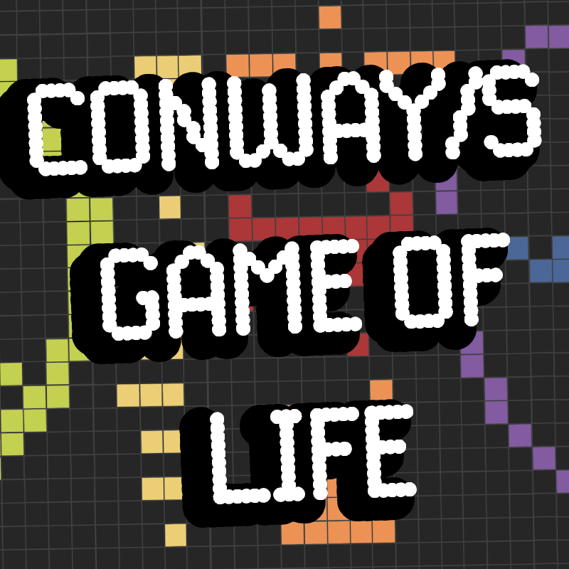
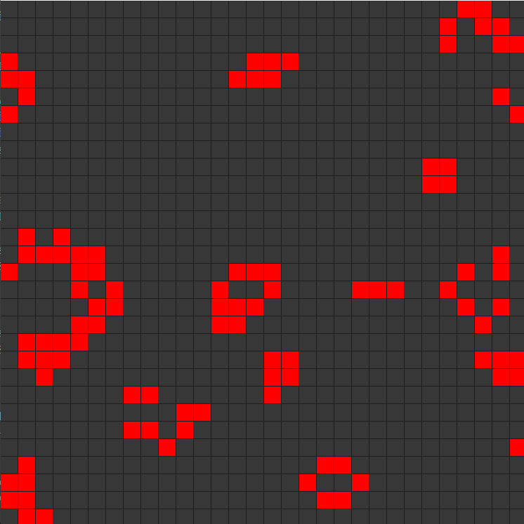

# Conway's Game of Life with Raylib 🌱🎮


This project implements **Conway's Game of Life** using **C++** and the **Raylib** library. The simulation provides an interactive experience where players can toggle cells, control the simulation speed, and generate random states or reset the grid.

## Project Overview 🎯

The **Game of Life** is a cellular automaton created by John Conway. It simulates the evolution of a 2D grid of cells, where each cell is either alive or dead. The grid evolves over discrete time steps according to a set of simple rules based on the states of neighboring cells.

## Project Components ⚙️

1. **Game Logic (`main.cpp`)**: Contains the primary game logic, including handling user input, managing the simulation state, and rendering the grid and cells.

2. **Simulation Class**:
   - **Simulation**: Manages the state of the grid, updating the cells, and rendering the grid.
   - Handles functions like toggling individual cells, starting, stopping, randomizing, and clearing the grid.

3. **Graphics**: The game features simple 2D graphics using the **Raylib** library.

## Features 🌟

- **Interactive Cell Toggling**: Click on cells with the mouse to toggle their state between alive and dead.
- **Simulation Control**: 
  - Press **Enter** to start the simulation.
  - Press **Space** to stop the simulation.
- **Speed Control**: 
  - Increase the simulation speed by pressing **F**.
  - Decrease the simulation speed by pressing **S**.
- **Random Grid Generation**: Press **R** to generate a random grid state.
- **Clear the Grid**: Press **C** to clear the grid and reset all cells.
- **Real-time Simulation**: The grid evolves in real-time, based on the Game of Life rules.

## Usage 🧑‍💻

1. **Download and Install Dependencies**:
    - You need to install **Raylib** and set up your C++ development environment.

2. **Run the Simulation**:
    - Compile the game using a suitable C++ compiler with Raylib linked.

3. **Interact with the Simulation**:
    - **Click**: Toggle the state of individual cells.
    - **Enter**: Start the simulation.
    - **Space**: Stop the simulation.
    - **F/S**: Increase or decrease the simulation speed.
    - **R**: Generate a random starting state.
    - **C**: Clear the grid.

4. **Game Objective**:
    - Observe how cells evolve over time following Conway's Game of Life rules, or interactively design your own patterns!

## Dependencies 📦

- **Raylib**: A simple and easy-to-use library for videogame programming.
- **C++ Compiler**: You will need a C++ compiler like g++, MSVC, or clang.
  
## Installation and Running the Game 🛠️

1. **Clone the Repository**:
    ```bash
    git clone https://github.com/your-username/game-of-life-raylib.git
    cd game-of-life-raylib
    ```

2. **Install Raylib**: Follow the installation instructions for your platform from the official Raylib website: [https://www.raylib.com/](https://www.raylib.com/).

3. **Compile the Game**:
    ```bash
    g++ main.cpp simulation.cpp -o game_of_life -lraylib -lGL -lm -lpthread -ldl -lrt -lX11
    ```

4. **Run the Game**:
    ```bash
    ./game_of_life
    ```

## Screenshots 📸



## Contributing 🫂

Contributions to enhance the simulation or add new features are welcome! Feel free to open issues or submit pull requests.

## Acknowledgements ⭐

- Special thanks to the creators of **Raylib** for providing a great library for building graphical applications with C++.
- Thanks to **John Conway** for creating the Game of Life and inspiring countless simulations and games based on his work.
